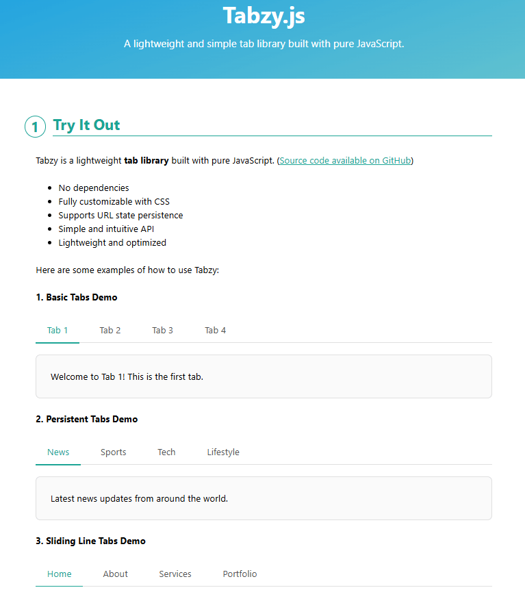

# Tabzy.js - Lightweight Vanilla JS Tab Library

Tabzy.js is a lightweight and easy-to-use **tab navigation library** written in **pure JavaScript**. It requires **no dependencies**, is fully customizable via **CSS**, and has an intuitive API for creating tabbed interfaces effortlessly.

## 📌 Demo


Try out Tabzy.js live:
🔗 **[Live Demo](https://thanhhang31023.github.io/tabzy/)**

## 🚀 Features
- 🔥 **No dependencies** – Runs on vanilla JavaScript.
- 🎨 **Fully customizable** – Modify tab styles easily with CSS.
- 📌 **Supports URL state persistence** – Keeps active tabs in sync with the URL.
- 🏗 **Lightweight** – Just **~3KB** minified.
- 🛠 **Simple API** – Easily create, customize, and manage tab navigation.
- 🚀 **Works everywhere** – Compatible with all modern browsers.

## 📦 Installation

### 1️⃣ **CDN (Recommended)**
Add the following lines to your HTML file:

```html
<!-- Tabzy CSS -->
<link rel="stylesheet" href="https://cdn.jsdelivr.net/gh/thanhhang31023/tabzy@v1.0.0/tabzy.min.css">

<!-- Tabzy JS -->
<script src="https://cdn.jsdelivr.net/gh/thanhhang31023/tabzy@v1.0.0/tabzy.min.js"></script>
```

### 2️⃣ **Download Manually**
[Download Tabzy.js](https://github.com/thanhhang31023/tabzy/archive/main.zip), extract the ZIP file, and include `tabzy.min.js` and `tabzy.min.css` in your project.

### 3️⃣ **Using NPM (Future Support)**
_Coming soon!_

## 🎯 Usage

### **Basic Example**
```html
<ul id="my-tabs">
    <li><a href="#tab1">Tab 1</a></li>
    <li><a href="#tab2">Tab 2</a></li>
</ul>
<div id="tab1">Content for Tab 1</div>
<div id="tab2" hidden>Content for Tab 2</div>
```

### **Initialize with JavaScript**
```js
const tabs = new Tabzy('#my-tabs', {
    activeClassName: 'tabzy--active',
    remember: true,
    onChange: ({ tab, panel }) => {
        console.log(`Switched to ${tab.textContent}`);
    }
});
```

## 🎨 Styling
Tabzy uses minimal CSS, allowing full customization. Here are some default classes:
```css
.tabzy-tabs { display: flex; border-bottom: 2px solid #ddd; }
.tabzy-tabs li { list-style: none; margin-right: 15px; }
.tabzy-tabs a { text-decoration: none; padding: 10px; display: block; }
.tabzy-tabs .tabzy--active a { font-weight: bold; border-bottom: 2px solid blue; }
```
You can override these styles to match your design.

## 📜 API Reference
```md
| Method                  | Description |
|-------------------------|-------------|
| `tabs.switch(target)`   | Switches to a specified tab |
| `tabs.destroy()`        | Destroys the Tabzy instance |
```

## 📬 Contact
- 👤 **NGUYEN THI THANH HANG**
- 📧 **thanhhang31023@gmail.com**

